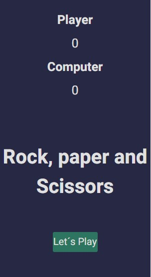
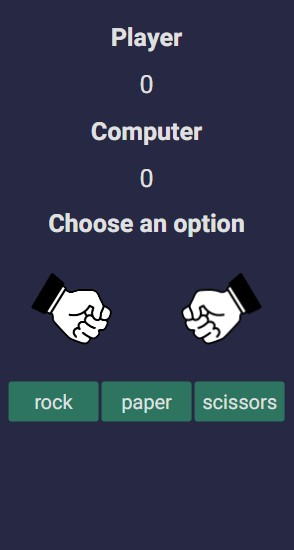
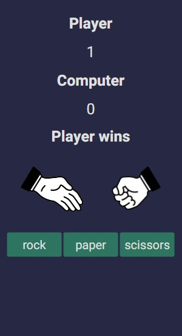

<!-- ABOUT THE PROJECT -->

## About The Project

    

        

            </i>
        

        

            </i>
        

        

            </i>
        
    
    

 
A simple and responsive game built with JavaScript, in which was possible to apply OOP and the most used JS functions.

### Built With

- [HTML]
- [CSS]
- [JavaScript]

<!-- CONTACT -->

## Contact

Salomão A. S. Nunes - [@salonunes](https://www.linkedin.com/in/salonunes/) - contato@salomaonunes.com.br

Project Link: [https://github.com/salomaonunes/rock_paper_scissors](https://github.com/salomaonunes/rock_paper_scissors)
